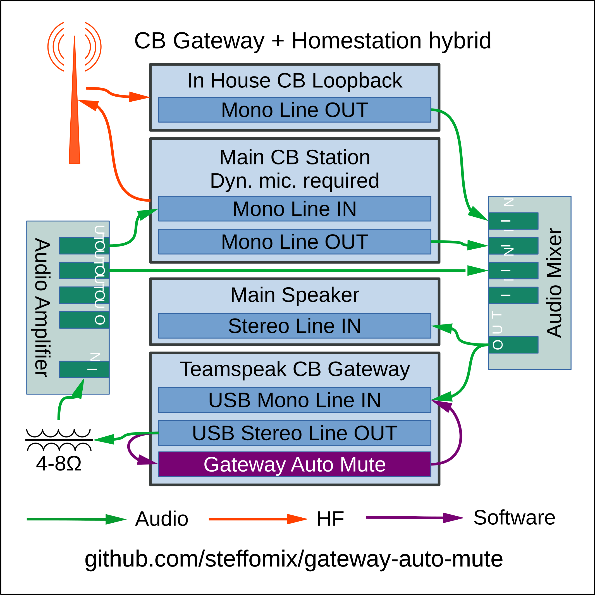
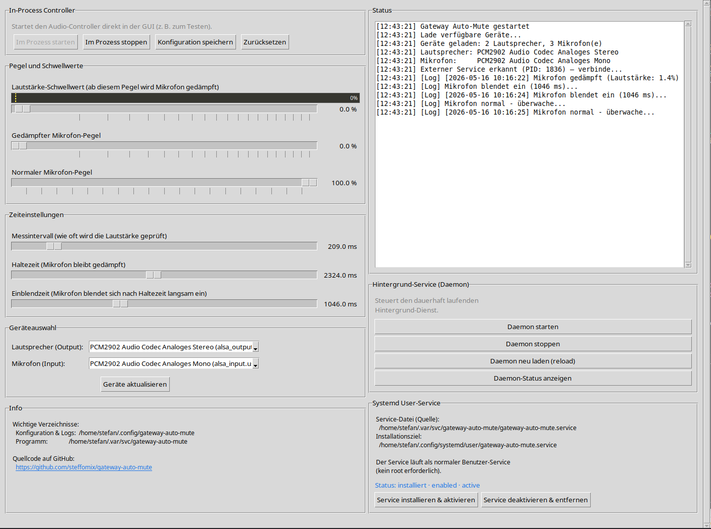

# Gateway Auto-Mute

**Automatische Mikrofon-Dämpfung für CB-Funk-Gateways — verhindert Audioechos und Rückkopplungen im Teamspeak-3-Gatewaysetup.**

---

## Inhaltsverzeichnis

- [Hintergrund und Motivation](#hintergrund-und-motivation)
- [Funktionsweise](#funktionsweise)
- [Gateway-Schema](#gateway-schema)
- [Programmoberfläche](#programmoberfläche)
- [Funktionsumfang](#funktionsumfang)
- [Systemanforderungen](#systemanforderungen)
- [Installation](#installation)
- [Erste Schritte](#erste-schritte)
- [Konfigurationsreferenz](#konfigurationsreferenz)
- [Service-Verwaltung](#service-verwaltung)
- [Projektstruktur](#projektstruktur)
- [Fehlerbehebung](#fehlerbehebung)
- [Lizenz](#lizenz)
- [Entwicklung](#entwicklung)

---

## Hintergrund und Motivation

In einem gemeinsam genutzten Teamspeak-3-Kanal sind zahlreiche CB-Funk-Gateways, externe Weiterleitungsserver und Benutzer aus verschiedenen Regionen zusammengeschlossen. Gateway-Betreiber sind dabei äußerst sensibel was Störungen betrifft — sie wünschen eine ruhige, disziplinierte Konversation ohne Echos, Rückkopplungen oder ungewollte Übertragungen.

Das oberste Gebot in einem solchen Verbund lautet daher:

> **Nur wenn nichts aus Teamspeak herausgeht, darf etwas in Teamspeak hineingehen.**

Bei einem CB-Funk-Gateway läuft auf einem Computer (z. B. Laptop oder Raspberry Pi) ein Teamspeak-3-Client, der als Brücke zwischen dem lokalen CB-Funkgerät und dem TS3-Server fungiert. Empfangene CB-Signale werden über den Mikrofon-Eingang an TS3 übertragen, und TS3-Audio wird über den Lautsprecher-Ausgang an das Funkgerät weitergeleitet.

**Das Problem:** Wenn TS3-Audio aus dem Lautsprecher erklingt, kann dieser Ton vom Mikrofon-Eingang aufgenommen werden — es entsteht eine Rückkopplung bzw. ein Echo, das auf den Teamspeak-Kanal zurückübertragen wird. Im schlimmsten Fall löst dies eine Sendekette aus, die alle verbundenen Gateways stört.

**Die Lösung:** Gateway Auto-Mute überwacht den Lautsprecher-Pegel in Echtzeit via PulseAudio. Sobald Audio aus Teamspeak erkannt wird, wird die Mikrofon-Empfindlichkeit automatisch auf einen konfigurierten Dämpfungspegel reduziert — solange, bis das Lautsprecher-Audio vollständig abgeklungen ist. So ist sichergestellt, dass niemals gleichzeitig etwas in Teamspeak hinein- und herausgeht.

---

## Funktionsweise

```
┌─────────────────────────────────────────────────────────────────┐
│                      Gateway Auto-Mute                          │
│                                                                 │
│  PulseAudio-Monitor                                             │
│  ┌──────────────┐    Pegel > Schwellwert?                       │
│  │  Lautsprecher │──────────────────────► JA: Mikrofon dämpfen  │
│  │  (TS3-Audio)  │                        NEIN: Normalpegel      │
│  └──────────────┘                                               │
│                            Haltezeit abgelaufen?                │
│                            ───────────────────► Normalpegel     │
└─────────────────────────────────────────────────────────────────┘
```

1. Der `AudioController` verbindet sich mit PulseAudio und überwacht die ausgewählte Lautsprecher-Soundkarte (Sink) in konfigurierbaren Messintervallen.
2. Überschreitet der Pegel den eingestellten Schwellwert, wird die Mikrofon-Quelle (Source) sofort auf den gedämpften Pegel gesetzt.
3. Nach Ablauf der Haltezeit (konfigurierbar) wird der Mikrofonpegel wieder auf den Normalpegel zurückgesetzt.
4. Ist das Ausgabegerät stummgeschaltet, wechselt das Programm automatisch in einen Ruhemodus und schont die CPU.

---

## Gateway-Schema

Das folgende Diagramm zeigt das Hardwaresetup, für das Gateway Auto-Mute entwickelt wurde — eine kombinierte CB-Gateway- und Heimstation, verbunden mit dem Teamspeak-3-Server von [freiesfunknetz.com](https://voice.freiesfunknetz.com):



### Signalfluss im Detail

| Verbindung | Beschreibung |
|---|---|
| **Antenne ↔ HF-Pfad** | CB-Empfang und -Sendung über die gemeinsame Antenne |
| **Beringer HA400 (Kopfhörerverstärker)** | Verteilt das eingehende CB-Audio auf mehrere Abnahmepunkte |
| **Main CB Station — Mono Line IN** | CB-Audio aus dem HA400 geht als Eingang in die Hauptstation |
| **Main CB Station — Mono Line OUT** | Sendepfad der Hauptstation zurück in den HF-Kreis |
| **In House CB Loopback — Mono Line OUT** | Lokale Abhörschleife (Monitoring vor Ort) |
| **Main Speaker — Stereo Line IN** | Lautsprecher-Wiedergabe des empfangenen CB-Signals |
| **Teamspeak CB Gateway — USB Mono Line IN** | CB-Audio geht als Mikrofon-Eingang in den TS3-Client |
| **Teamspeak CB Gateway — USB Stereo Line OUT** | TS3-Audio wird zur Heimstation weitergeleitet (Sendepfad) |
| **Beringer MX400 (Audiomixer)** | Mischt die Signale für die verschiedenen Ausgabeziele |
| **Gateway Auto-Mute (Software)** | Überwacht den USB Stereo Line OUT und dämpft den USB Mono Line IN automatisch |

> **Hinweis:** Die im Diagramm verwendeten Beringer-Geräte (HA400, MX400) sind lediglich preiswerte Beispielgeräte. Jedes andere Gerät mit ähnlicher Funktion — egal ob Kaufgerät eines anderen Herstellers oder Eigenbau — ist genauso geeignet. Entscheidend ist nur der Signalfluss, nicht das konkrete Modell.

> **Gateway Auto-Mute** (lila Pfeil im Diagramm) überwacht softwareseitig den Lautsprecher-Ausgang der USB-Soundkarte und sperrt automatisch den Mikrofon-Eingang, solange TS3-Audio erkannt wird — bevor es zur Rückkopplung oder Störung der anderen Gateways im Verbund kommen kann.

---

## Programmoberfläche



Die GUI ist in vier Bereiche aufgeteilt:

- **Links oben — In-Process Controller:** Startet und stoppt den Audio-Controller direkt in der GUI (z. B. zum Testen) und speichert die Konfiguration.
- **Links Mitte — Pegel und Schwellwerte / Zeiteinstellungen / Geräteauswahl:** Alle einstellbaren Parameter auf einen Blick.
- **Rechts oben — Status:** Live-Log des Audio-Controllers mit Zeitstempeln.
- **Rechts unten — Hintergrund-Service (Daemon) / Systemd User-Service:** Steuert den dauerhaft laufenden Dienst und zeigt dessen Installationsstatus.

---

## Funktionsumfang

- **Echtzeit-Pegelüberwachung** via PulseAudio Monitor-Source
- **Automatische Mikrofon-Dämpfung** bei Lautsprecher-Aktivität oberhalb eines Schwellwerts
- **Visueller Pegelanzeige-Balken** in der GUI mit farbiger Schwellwert-Linie
- **Vollständig konfigurierbar** — Schwellwert, Dämpfungspegel, Normalpegel, Haltezeit und Messintervall
- **Flexible Geräteauswahl** für beliebige PulseAudio-Quellen und -Senken
- **Hintergrund-Daemon** — läuft ohne GUI und kann beim Systemstart aktiviert werden
- **Grafische Benutzeroberfläche** (Tkinter) mit Live-Statusanzeige
- **Automatischer Idle-Modus** bei stummgeschalteten Geräten (CPU-schonend)
- **Persistente Konfiguration** unter `~/.config/gateway-auto-mute/config.json`
- **systemd-Service-Datei** für den Autostart enthalten

---

## Systemanforderungen

| Anforderung | Details |
|---|---|
| **Betriebssystem** | Linux mit PulseAudio (Ubuntu, Debian, Raspberry Pi OS, …) |
| **Python** | 3.8 oder höher |
| **PulseAudio** | Muss laufen (`pulseaudio --check`) |
| **Python-Pakete** | `pulsectl >= 23.5.0`, `pyperclip >= 1.8.2` |
| **Optionale Systempakete** | `portaudio19-dev`, `python3-dev`, `pulseaudio-utils` |

---

## Installation

### Variante 1 — Automatisches Installations-Skript (empfohlen)

```bash
git clone https://github.com/<dein-benutzer>/gateway-auto-mute.git
cd gateway-auto-mute
chmod +x install.sh
./install.sh
```

Das Skript:
- Prüft Python 3 und pip
- Fragt optional nach Systempaketen (`portaudio19-dev`, `pulseaudio-utils`)
- Erstellt eine virtuelle Python-Umgebung unter `venv/`
- Installiert alle Abhängigkeiten aus `requirements.txt`

---

### Variante 2 — Manuelle Installation

**1. Repository herunterladen**

```bash
git clone https://github.com/<dein-benutzer>/gateway-auto-mute.git
cd gateway-auto-mute
```

**2. Systempakete installieren** (optional, aber empfohlen)

```bash
sudo apt-get update
sudo apt-get install -y portaudio19-dev python3-dev pulseaudio-utils
```

**3. Virtuelle Umgebung erstellen und aktivieren**

```bash
python3 -m venv venv
source venv/bin/activate
```

**4. Python-Abhängigkeiten installieren**

```bash
pip install --upgrade pip
pip install -r requirements.txt
```

---

### Variante 3 — Systemweite Installation (ohne venv)

```bash
pip3 install -r requirements.txt
```

> **Hinweis:** Für Raspberry Pi empfiehlt sich die Verwendung einer virtuellen Umgebung, um Konflikte mit Systempaketen zu vermeiden.

---

## Erste Schritte

### Schritt 1 — GUI starten

```bash
# Mit virtueller Umgebung
source venv/bin/activate
python3 main.py

# Oder direkt über das Startskript
./start.sh
```

Das Hauptfenster **„Gateway Auto-Mute Konfiguration"** öffnet sich.

---

### Schritt 2 — Audiogeräte auswählen

Im oberen Bereich der GUI befinden sich zwei Dropdown-Menüs:

- **Lautsprecher (Ausgabe):** Wählen Sie das Gerät, das Sie überwachen möchten — in der Regel die externe USB-Soundkarte oder das Gerät, über das TS3-Audio ausgegeben wird.
- **Mikrofon (Eingabe):** Wählen Sie die Quelle, die beim Lautsprecher-Signal gedämpft werden soll — typischerweise derselbe USB-Soundkarten-Eingang.

Klicken Sie auf **„Geräte aktualisieren"**, falls Ihre Geräte nicht in der Liste erscheinen.

> **Tipp:** Mit `pactl list sinks short` und `pactl list sources short` können Sie im Terminal alle verfügbaren PulseAudio-Geräte auflisten.

---

### Schritt 3 — Schwellwerte konfigurieren

Passen Sie die Regler an Ihre Hardware an:

| Einstellung | Beschreibung | Empfohlener Startwert |
|---|---|---|
| **Lautstärke-Schwellwert** | Ab diesem Lautsprecherpegel wird gedämpft | 10 % |
| **Normaler Mikrofonpegel** | Empfindlichkeit ohne aktiven Lautsprecher | 80 % |
| **Gedämpfter Mikrofonpegel** | Empfindlichkeit bei aktivem Lautsprecher | 10 % |
| **Haltezeit** | Wie lange die Dämpfung nach Ende des Signals anhält | 500 ms |
| **Messintervall** | Wie oft der Lautsprecherpegel gemessen wird | 50 ms |

Der **Pegelanzeige-Balken** beim Schwellwert-Regler zeigt den aktuellen Lautsprecherpegel in Echtzeit:
- **Grün:** Pegel liegt unter dem Schwellwert — Mikrofon aktiv
- **Rot:** Pegel überschreitet den Schwellwert — Mikrofon gedämpft
- **Gelbe Linie:** Aktuell eingestellter Schwellwert

---

### Schritt 4 — Service starten und testen

1. Klicken Sie auf **„Service starten"** in der GUI.
2. Der Statusbereich zeigt die aktuellen Meldungen des Audio-Controllers.
3. Spielen Sie Testton über den überwachten Lautsprecher ab — der Status sollte von *„Überwache Audio…"* auf *„Mikrofon gedämpft"* wechseln.
4. Wenn alles korrekt funktioniert, klicken Sie auf **„Konfiguration speichern"**.

---

### Schritt 5 — Service im Hintergrund betreiben (optional)

Für den Dauerbetrieb ohne geöffnete GUI:

```bash
# Service starten
python3 service_manager.py start

# Status prüfen
python3 service_manager.py status

# Service stoppen
python3 service_manager.py stop
```

---

### Schritt 6 — Autostart mit systemd einrichten (optional)

Die mitgelieferte `gateway-auto-mute.service`-Datei ermöglicht den automatischen Start beim Systemstart. Passen Sie zunächst die Pfade in der Datei an Ihr System an:

```bash
# Servicedatei in den User-Systemd-Ordner kopieren
mkdir -p ~/.config/systemd/user/
cp gateway-auto-mute.service ~/.config/systemd/user/

# Pfade in der Servicedatei anpassen
nano ~/.config/systemd/user/gateway-auto-mute.service

# Service aktivieren und starten
systemctl --user daemon-reload
systemctl --user enable gateway-auto-mute.service
systemctl --user start gateway-auto-mute.service

# Status prüfen
systemctl --user status gateway-auto-mute.service
```

---

## Konfigurationsreferenz

Die Konfiguration wird gespeichert unter `~/.config/gateway-auto-mute/config.json`.

| Schlüssel | Typ | Standard | Beschreibung |
|---|---|---|---|
| `speaker_device` | String | `""` | Name oder Index der Lautsprecher-Soundkarte |
| `microphone_device` | String | `""` | Name oder Index der Mikrofon-Soundkarte |
| `volume_threshold` | Float | `10` | Lautsprecher-Schwellwert in Prozent (0–100) |
| `mic_normal_level` | Float | `80` | Normaler Mikrofonpegel in Prozent (0–100) |
| `mic_muted_level` | Float | `10` | Gedämpfter Mikrofonpegel in Prozent (0–100) |
| `hold_time` | Int | `500` | Haltezeit nach letztem Signal in Millisekunden |
| `polling_interval` | Int | `50` | Messintervall in Millisekunden |

Beispiel `config.json`:

```json
{
    "speaker_device": "alsa_output.usb-C-Media_Electronics_Inc.",
    "microphone_device": "alsa_input.usb-C-Media_Electronics_Inc.",
    "volume_threshold": 10,
    "mic_normal_level": 80,
    "mic_muted_level": 10,
    "hold_time": 500,
    "polling_interval": 50
}
```

---

## Service-Verwaltung

### Über den Service-Manager

```bash
# Im Hintergrund starten
python3 service_manager.py start

# Stoppen
python3 service_manager.py stop

# Neu starten
python3 service_manager.py restart

# Status und PID anzeigen
python3 service_manager.py status

# Aktuelle Konfiguration anzeigen
python3 service_manager.py config
```

### Relevante Dateien

| Pfad | Beschreibung |
|---|---|
| `~/.config/gateway-auto-mute/config.json` | Konfigurationsdatei |
| `~/.config/gateway-auto-mute/service.pid` | PID des laufenden Daemons |
| `~/.config/gateway-auto-mute/service.log` | Service-Log-Datei |

---

## Projektstruktur

```
gateway-auto-mute/
├── main.py                    # Einstiegspunkt — startet die GUI
├── gui.py                     # Tkinter-GUI mit Schiebereglern und Pegelanzeige
├── audio_controller.py        # PulseAudio-Überwachung und Mikrofon-Steuerung
├── config.py                  # Konfigurationsverwaltung (JSON)
├── service_manager.py         # Hintergrund-Daemon-Verwaltung
├── install.sh                 # Automatisches Installations-Skript
├── start.sh                   # Startskript für die GUI
├── gateway-auto-mute.service  # systemd User-Service-Unit
├── requirements.txt           # Python-Abhängigkeiten
├── images/
│   ├── gateway-auto-mute-schema.png      # Schematischer Hardwareaufbau
│   └── gateway-auto-mute-screenshot.png  # Screenshot der Benutzeroberfläche
├── LICENSE
└── README.md
```

---

## Fehlerbehebung

### Geräte erscheinen nicht in der Liste

```bash
# PulseAudio-Status prüfen
pulseaudio --check && echo "läuft" || echo "läuft nicht"

# PulseAudio neu starten
pulseaudio --kill && pulseaudio --start

# Verfügbare Ausgabegeräte auflisten
pactl list sinks short

# Verfügbare Eingabegeräte auflisten
pactl list sources short
```

### Mikrofon wird nicht gedämpft

- Prüfen Sie, ob der **Schwellwert** nicht zu hoch eingestellt ist.
- Kontrollieren Sie, ob das Ausgabegerät in PulseAudio nicht stummgeschaltet ist (`pactl list sinks | grep Mute`).
- Öffnen Sie die GUI und beobachten Sie den **Pegelanzeige-Balken** — zeigt er Ausschlag, wenn Audio abgespielt wird?
- Überprüfen Sie die Statusmeldungen im unteren Bereich der GUI.

### Service startet nicht erneut (verwaiste PID-Datei)

```bash
rm ~/.config/gateway-auto-mute/service.pid
python3 service_manager.py start
```

### Fehler: `pulsectl` nicht gefunden

```bash
source venv/bin/activate
pip install pulsectl
```

### `ImportError: No module named tkinter`

```bash
sudo apt-get install python3-tk
```

### Raspberry Pi: PulseAudio läuft nicht als User-Service

```bash
# PulseAudio im User-Modus starten
pulseaudio --start --log-target=syslog

# Oder dauerhaft aktivieren
systemctl --user enable pulseaudio
systemctl --user start pulseaudio
```

---

## Lizenz

Siehe [LICENSE](LICENSE) für Details.

---

## Entwicklung

Dieses Programm wurde zu **100 % von [Claude AI](https://claude.ai) (Anthropic)** geschrieben — vom ersten Konzept bis zur fertigen Implementierung. Der Mensch hinter dem Projekt hat die Anforderungen formuliert, das Ergebnis getestet und die Hardware aufgebaut; den gesamten Quellcode hat Claude AI erzeugt.

---

*Entwickelt für das CB-Funk-Gateway SHG@JO42OH, Kanal 80 — Teamspeak 3 via [voice.freiesfunknetz.com](https://voice.freiesfunknetz.com)*
